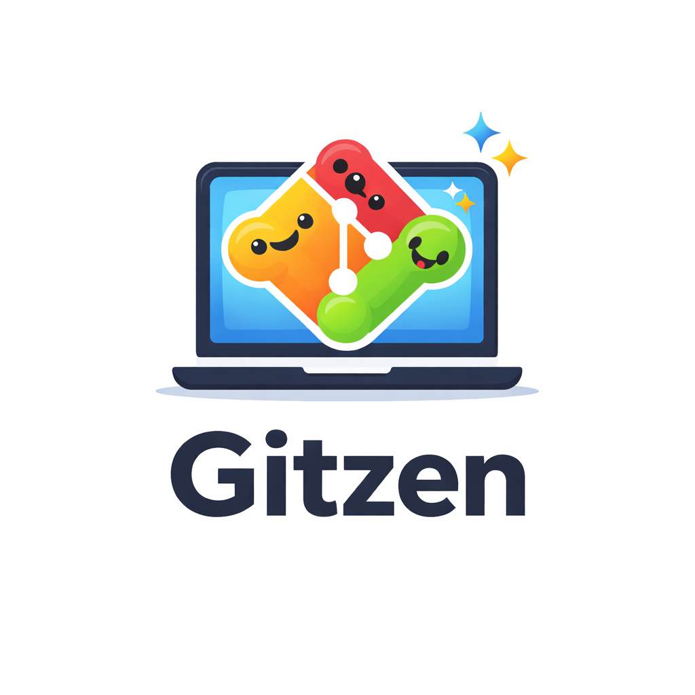
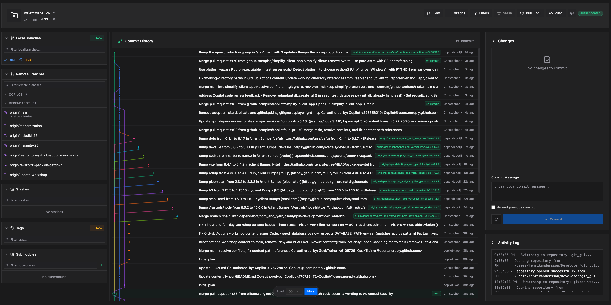

<p align="center">
  
</p>

<h1 align="center">Gitzen</h1>

<p align="center">
  <strong>A modern, fast, and beautifully designed Git GUI application.</strong>
</p>

<p align="center">
  
  
</p>



## Overview

Gitzen aims to provide a reliable and efficient interface for managing Git repositories. Unlike many other GUI clients that bundle their own Git implementations, Gitzen directly utilizes your system's native `git` binary, guaranteeing absolute compatibility with your existing configurations, hooks, and SSH setups.

## ✨ Key Features

- **Intuitive Commit History:** Clear commit history tree with robust branch and tag visualization.
- **Rich Diff Viewer:** Inspect file changes with a fluid side-by-side or unified diff viewer, featuring full character and word-level diffing.
- **Selective Staging:** Easily stage and unstage specific hunks, or even individual lines of code directly from the UI.
- **Repository Analytics:** Visualize repository churn, file types, and code activity using built-in interactive charts.
- **Modern UI & Themes:** Hand-crafted, modern themes (Dark & Light) optimized for minimal eye strain, built with Tailwind CSS and Radix UI.
- **Native Git Integration:** Explicitly shells out to your local system's `git` binary—no outdated NodeGit dependencies.
- **Secure Credentials:** Secure storage of git credentials using system keychains.

## 🚀 Getting Started

### Prerequisites

- [Node.js](https://nodejs.org/) (v16 or higher)
- npm or yarn
- **Git** must be installed and accessible in your system's `PATH`.

### Installation

1. **Clone the repository:**
   ```bash
   git clone https://github.com/0HenrikAndersson0/git_gui.git
   cd git_gui
   ```
   *(Note: Adjust the repository URL based on where it is hosted.)*

2. **Install dependencies:**
   ```bash
   npm install
   ```

### Development

To start the development environment (which runs the Vite dev server for the frontend and the Electron app concurrently):

```bash
npm run dev
```

TSC will automatically watch for changes in the main process. If you only need to compile the main process:

```bash
npm run compile
```

## 🛠 Architecture & Tech Stack

- **Runtime (Main Process):** Electron, Node.js (`/src`)
  - Handles file system accesses, `gitService` command operations, and secure `CredentialManager`.
- **Frontend (Renderer Process):** React, TypeScript, Vite, Tailwind CSS (`/renderer/src`)
  - Features functional modular UI components for panes.
- **UI Components:** Radix UI, Lucide React, Recharts (for analytics), Sonner (for localized toasts).
- **Bridge:** Secure IPC via `contextBridge` in `preload.js`.

## 📦 Building for Production

Compile the TypeScript main process, build the Vite renderer bundle, and package the overall Electron app using `electron-builder`:

```bash
# General production build
npm run build

# Platform-specific builds
npm run build:mac
npm run build:linux
npm run build:win
```

## 🔒 Security

This project implements Electron's recommended security and sandboxing best practices:
- **Context Isolation:** Enabled
- **Node Integration:** Disabled in renderer
- **Preload Script:** Used to expose a strictly controlled, secure API layer to the renderer environment, masking command logs for sensitive URLs or credentials.

## 🤝 Contributing

Gitzen is an open-source project, and contributions are welcome! Whether it's reporting a bug, proposing a feature, or submitting a pull request, your input helps make Gitzen better.

1. Fork the repository
2. Create your feature branch (`git checkout -b feature/amazing-feature`)
3. Commit your changes (`git commit -m 'Add some amazing feature'`)
4. Push to the branch (`git push origin feature/amazing-feature`)
5. Open a Pull Request

Please make sure to ask for confirmation or discuss large changes in an issue before making a significant pull request.

## 📄 License

This project is licensed under the MIT License - see the [LICENSE](LICENSE) file or `package.json` for details.
