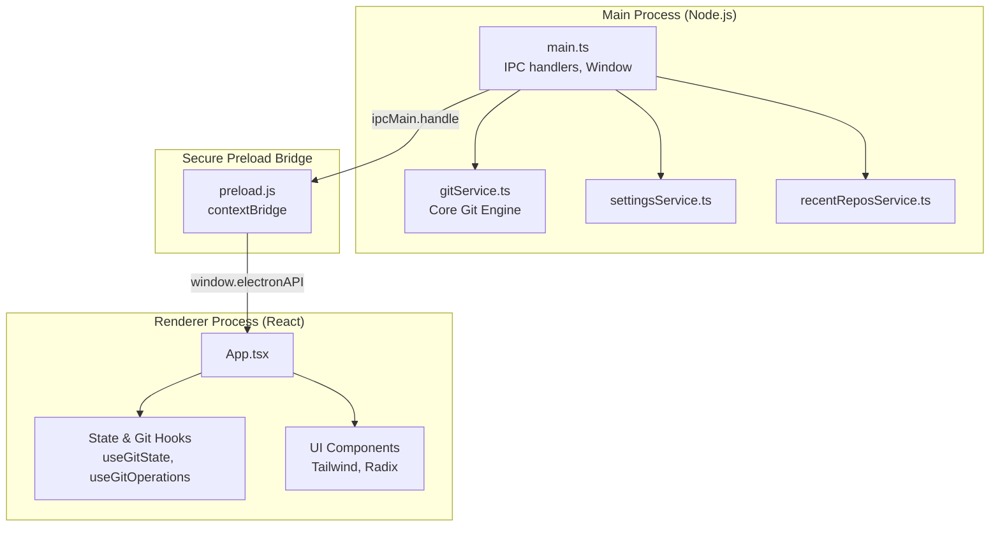

# Gitzen - Project Overview

## 🎯 Vision & Goals

Gitzen is a modern, fast, and beautifully designed Git GUI application. Its primary goal is to provide a reliable, efficient, and visually pleasing interface for managing Git repositories. 

Unlike many legacy GUI clients that bundle custom Git implementations (like NodeGit) or ship their own isolated Git environments, Gitzen is designed to act as a lightweight shell over your system's native `git` binary. This guarantees that any existing terminal configurations, SSH keys, hooks, and credential helpers work perfectly out of the box without any complex setup.

## 🛠️ Technology Stack

- **Application Framework:** Electron
- **Main Process (Backend):** Node.js, TypeScript
- **Renderer Process (Frontend):** React 19, TypeScript, Vite
- **Styling:** Tailwind CSS v4, Radix UI primitives, Lucide React (Icons)
- **Data Visualization:** Recharts (for commit graphs and repo churn)
- **State Management:** Custom React hooks fetching via IPC Bridge
- **Packaging:** electron-builder

## 🏗️ Core Architecture



The application strictly follows Electron's recommended security practices by isolating the Node.js environment from the web frontend.

### 1. Main Process (`/src`)
The backend of the application handles all heavy lifting, file system access, and command execution.
- **`gitService.ts`**: The core engine. It utilizes Node's `child_process` (`exec`, `spawn`) to execute Git commands directly on the user's system. It parses the raw stdout/stderr and formats it into structured JSON data.
- **`settingsService.ts`**: Manages persistent user preferences (e.g., AI providers, themes) by saving them to disk.
- **`recentReposService.ts`**: Tracks the user's recently opened repositories.

### 2. Preload Bridge (`preload.js`)
Acts as the secure intermediary layer. It uses Electron's `contextBridge` to expose a strictly controlled API (`window.electronAPI`) to the renderer. The frontend cannot access Node modules or the file system directly; it must invoke methods exposed here.

### 3. Renderer Process (`/renderer/src`)
The React frontend is built as a Single Page Application (SPA).
- **Component Driven:** The UI is split into focused components (`CommitPanel`, `BranchesPanel`, `DiffViewer`).
- **Responsive Layout:** Panes are conditionally rendered and resizable, providing a fluid side-by-side or unified diff viewing experience.

## 🔐 Authentication & Credentials

Gitzen deliberately **does not** handle raw passwords or tokens directly for Git operations. Instead, it relies on the system-level Git credentials:
- If a user can run `git push` in their terminal, they can do it in Gitzen.
- Support for SSH Keys, Git Credential Manager (GCM), and macOS Keychain is seamless because Gitzen simply shells out to `git`.

## 🤖 AI Integrations

Gitzen features deep integration with agentic and local LLMs to accelerate development workflows. The AI features include auto-generating commit messages, explaining merge conflicts, and summarizing entire branch changes for PRs.

The system is highly flexible and supports multiple providers:
- **Local:** Ollama (Runs entirely offline via local API calls).
- **CLI Integrations:** Integrates natively with `claude` (Anthropic), `gh copilot` (GitHub), and `agy` (Antigravity). When invoking these, the main process dynamically constructs shell scripts to securely pass the git diff context to the respective CLI tools.

## 📂 Directory Structure

```text
git_gui/
├── src/                # Electron Main Process (TypeScript)
├── renderer/           # React Frontend (Vite)
│   ├── src/
│   │   ├── components/ # Modular UI components
│   │   ├── hooks/      # State and git operation hooks
│   │   ├── lib/        # Utility functions
│   │   └── index.css   # Tailwind entrypoint
├── docs/               # Project documentation
├── scripts/            # Build and release automation scripts
├── dist/               # Compiled Main Process output (generated)
└── release/            # Packaged application binaries (generated)
```
