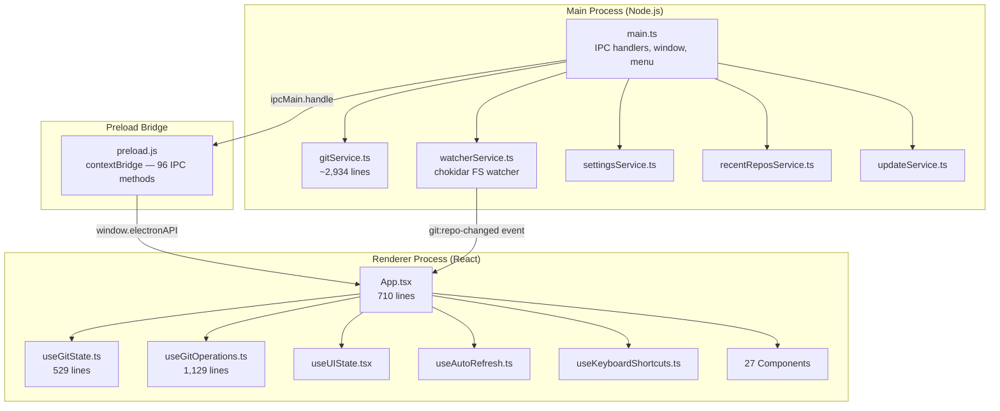

# Gitzen — Project Overview & Audit

**Version**: `0.8.12-alpha-1`  
**Stack**: Electron 28 · React 18 · TypeScript · Vite · Tailwind CSS  
**Git Integration**: Direct `child_process.spawn` to the system `git` binary

---

## 1. Architecture & Project Structure

### Key Observations

| Metric | Value |
|---|---|
| Total IPC channels | **~96** (preload.js) |
| Git service functions | **~65** exported functions |
| Frontend components | **27** + UI primitives |
| Custom hooks | **5** (state, operations, UI, auto-refresh, shortcuts) |
| Lines in gitService.ts | **2,934** |
| Lines in useGitOperations.ts | **1,129** |

> [!NOTE]
> The codebase is well-organized with a clear separation between the main process (git execution), preload bridge (IPC), and renderer (React UI). The hook-based architecture (`useGitState`, `useGitOperations`, `useUIState`) keeps `App.tsx` manageable despite the large feature set.

---

## 2. Git Operations — Feature Coverage

### Core Operations ✅
| Feature | Status | Notes |
|---|---|---|
| Clone | ✅ | With progress streaming & auth env |
| Open repository | ✅ | `.git` directory check |
| Status (porcelain) | ✅ | Handles renames, untracked, staged/unstaged |
| Stage / Unstage files | ✅ | Uses `git rm` for deleted files |
| Stage/Unstage all | ✅ | |
| Commit (with message) | ✅ | |
| Amend commit | ✅ | |
| Undo last commit | ✅ | Handles initial commit edge case |
| Push | ✅ | `--force-with-lease` and `--force` support |
| Pull | ✅ | Fetch-to-branch for non-current branches |
| Fetch (single/all remotes) | ✅ | With `--prune` |

### Branch Management ✅
| Feature | Status | Notes |
|---|---|---|
| List local branches (detailed) | ✅ | `for-each-ref` with ahead/behind |
| List remote branches | ✅ | |
| Create branch (+ checkout) | ✅ | |
| Checkout (local + remote tracking) | ✅ | Smart remote-to-local creation |
| Delete local branch | ✅ | `-d` / `-D` |
| Delete remote branch | ✅ | `push --delete` + prune |
| Rename branch | ✅ | Just added — `git branch -m` |
| Branch status (ahead/behind) | ✅ | |

### Advanced Operations ✅
| Feature | Status | Notes |
|---|---|---|
| Merge (with conflict detection) | ✅ | `--no-ff`, MERGE_HEAD check |
| Rebase | ✅ | Simple + interactive |
| Interactive Rebase | ✅ | Custom GIT_SEQUENCE_EDITOR via temp Node script |
| Cherry-pick | ✅ | `-x` flag, abort/continue/skip |
| Revert commit | ✅ | `--no-edit`, conflict detection |
| Reset (soft/mixed/hard) | ✅ | |
| Stash (create/apply/delete) | ✅ | |
| Abort operations (merge/rebase/cherry-pick) | ✅ | Unified `abortConflict` |

### Extras ✅
| Feature | Status | Notes |
|---|---|---|
| Tags (create/delete/push/list remote) | ✅ | Annotated + lightweight |
| Git Blame | ✅ | Line-porcelain parsing |
| File diff (staged/unstaged/untracked) | ✅ | `--no-index` for untracked |
| Commit diff | ✅ | `-m --first-parent` for merges |
| Git Flow (init/start/finish) | ✅ | Full lifecycle without `git-flow` CLI |
| Submodules (list/add/sync/remove) | ✅ | Includes deinit + cache purge |
| Graphs & analytics | ✅ | Churn, activity, contributors, growth, file types |
| Credentials test | ✅ | `ls-remote` probe |
| User config (get/set) | ✅ | Local + global scope |
| Remote management | ✅ | Add, get/set URL |
| File system watcher | ✅ | chokidar with 200ms debounce |
| Auto-update check | ✅ | GitHub releases |

---

## 3. Performance Analysis

### 🟢 Good Patterns

1. **`spawn` over `exec`**: All git commands use `spawn` via `runGitSpawn()`, avoiding shell injection and supporting streaming + `AbortController` cancellation.

2. **Operation queue**: The `runQueued()` pattern in `useGitState` serializes concurrent IPC calls, preventing race conditions on the global `currentRepoPath`.

3. **Debounced file watcher**: The `watcherService` uses a 200ms debounce on FS events, preventing UI thrashing during rapid changes (e.g., rebases).

4. **Stale-path guards**: Every refresh callback compares `targetPath !== repoPathRef.current` before committing state updates—preventing cross-repo data contamination when switching repos.

5. **`react-window` virtualization**: The commit history uses windowed rendering for large lists.

### 🟡 Areas of Concern

> [!WARNING]
> #### 1. `JSON.stringify` equality checks in state updates
> Multiple state setters use `JSON.stringify(prev) !== JSON.stringify(newState)` to avoid unnecessary re-renders (e.g., [useGitState.ts:102](file:///Users/henrikandersson/Developer/git_gui/renderer/src/hooks/useGitState.ts#L102), [204](file:///Users/henrikandersson/Developer/git_gui/renderer/src/hooks/useGitState.ts#L204), [296](file:///Users/henrikandersson/Developer/git_gui/renderer/src/hooks/useGitState.ts#L296)).
> 
> This is **O(n)** on every refresh cycle, and for large commit histories (up to 2,000 commits with full message bodies), this serialization adds up. Consider a cheaper comparison like checking array length + first/last element hash, or using a generation counter / ETag pattern from the backend.

> [!WARNING]
> #### 2. `onRepoChanged` triggers 10 parallel IPC calls
> When the file watcher fires, [useGitState.ts:409-419](file:///Users/henrikandersson/Developer/git_gui/renderer/src/hooks/useGitState.ts#L409-L419) triggers **10 separate refresh functions** sequentially through the queue, including a `fetchAll` on every single FS change. On busy repos (e.g., `npm install`), this means:
> - 10+ git subprocess spawns per debounce cycle
> - A full `git fetch --prune` for every remote on every FS change
> 
> **Recommendation**: The `performFetchSilent()` call in the `onRepoChanged` handler is especially heavy; consider removing it from the watcher response (it's already on a focus event handler) or rate-limiting it to at most once per 30-60 seconds.

> [!WARNING]
> #### 3. `getHistory` runs 3 passes over the commit data
> The `getHistory()` function in [gitService.ts:860-977](file:///Users/henrikandersson/Developer/git_gui/src/gitService.ts#L860-L977) performs:
> - Pass 1: Extract branch refs
> - Pass 2: Propagate branch labels (up to 10 iterations)
> - Pass 3: Build final commit objects
> 
> For 2,000 commits, the propagation loop (Pass 2) iterates over the full list up to 10 times, building a `parentToChildren` map each time. This is **O(commits × iterations)**. Consider building the map once and propagating in a single BFS/DFS pass.

> [!IMPORTANT]
> #### 4. `useGitOperations` uses `any` types throughout
> The hook's props are typed as `any` ([useGitOperations.ts:7](file:///Users/henrikandersson/Developer/git_gui/renderer/src/hooks/useGitOperations.ts#L7)), and many IPC calls use `(window as any).electronAPI`. This bypasses TypeScript's type checking entirely, making it easy to introduce bugs when adding or changing IPC methods. The type definitions exist in `electron.d.ts` — the hook should use `window.electronAPI` directly (which is already declared in the type file).

---

## 4. Logical Issues & Potential Bugs

> [!CAUTION]
> #### 1. Command injection via `runGitCommand` string splitting
> `runGitCommand()` at [line 199](file:///Users/henrikandersson/Developer/git_gui/src/gitService.ts#L199) splits the command string using a simple regex: `command.match(/(?:[^\s"]+|"[^"]*")+/g)`. This works for simple cases, but **branch names or commit messages containing quotes or special characters** could break. For example:
> - `renameBranch("my branch", "new\"name")` → the inner quote in `newName` would break the split
> - `commit()` at line 509 escapes `"` as `\"` but then passes through the same string splitter
>
> Several functions already use `runGitExecFile()` with proper argument arrays (`stageFiles`, `mergeBranchToCurrent`, `checkoutBranch`). The remaining ones (commit, createBranch, rebase, etc.) should be migrated to use `runGitExecFile` with explicit `args[]` to avoid edge cases.

> [!CAUTION]
> #### 2. `deleteBranch` / `createBranch` don't sanitize branch names
> At [gitService.ts:1573](file:///Users/henrikandersson/Developer/git_gui/src/gitService.ts#L1573), `deleteBranch` passes the branch name directly into a string command: `branch -d ${branchName}`. A branch named `main; rm -rf /` would be safely handled by `runGitSpawn()` (which splits args), **but** the quote-splitting regex could misinterpret names with spaces. This is low-risk but worth noting.

> [!WARNING]
> #### 3. `stageFiles` is O(n) subprocesses
> [gitService.ts:426-444](file:///Users/henrikandersson/Developer/git_gui/src/gitService.ts#L426-L444) stages files **one at a time** in a for-loop, spawning a new process for each file. For 100 changed files, this means 100 `git add` or `git rm` calls. Instead, `git add -- file1 file2 file3` supports multiple paths in a single invocation.

> [!NOTE]
> #### 4. `unstageFiles` has the same O(n) behavior
> [gitService.ts:488-493](file:///Users/henrikandersson/Developer/git_gui/src/gitService.ts#L488-L493) also runs `git reset HEAD -- file` per file. Same fix applies.

> [!WARNING]
> #### 5. `openRepository` checks only `.git` directory
> [gitService.ts:342](file:///Users/henrikandersson/Developer/git_gui/src/gitService.ts#L342) uses `fs.existsSync(path.join(repoPath, '.git'))`. This will fail for:
> - Git worktrees (`.git` is a file, not a directory)
> - Submodules opened directly (`.git` may be a file pointing to the parent)
> 
> Consider using `git rev-parse --git-dir` instead.

> [!NOTE]
> #### 6. `getAuthEnv` is a no-op
> [gitService.ts:78-83](file:///Users/henrikandersson/Developer/git_gui/src/gitService.ts#L78-L83) returns a static object `{ GIT_TERMINAL_PROMPT: '0', LC_ALL: 'C' }` regardless of the remote URL parameter. This is fine as a baseline, but the `remoteUrl` parameter creates a false expectation that credential injection is URL-aware. The unused parameter should be documented or removed.

---

## 5. Code Quality Summary

### Strengths
- **Comprehensive feature set**: Nearly every common git operation is covered, including advanced workflows (interactive rebase, cherry-pick, Git Flow, submodules).
- **Clean IPC architecture**: Every backend function follows a consistent `{ success, error?, errorType? }` return pattern.
- **Error classification**: `parseGitError()` categorizes errors into typed classes (`NetworkAuthError`, `MergeConflictError`, `DetachedHeadError`, `CommandNotFoundError`).
- **Conflict handling**: Robust MERGE_HEAD / REBASE_MERGE / CHERRY_PICK_HEAD detection with proper abort/continue flows.
- **UI state management**: Well-separated into domain hooks, preventing `App.tsx` from becoming monolithic.

### Weaknesses
- **gitService.ts is ~3K lines**: This single file handles everything from cloning to graph analytics. It would benefit from being split into modules (e.g., `branchService`, `diffService`, `graphsService`).
- **`any` type pollution**: `useGitOperations` and several components use `(window as any)` instead of the typed `window.electronAPI`.
- **No unit tests for frontend**: Test files exist only for `gitService.test.ts` and `branchManagement.test.ts` in the `src/` directory. No renderer-side tests.
- **`useAutoRefresh` hook is unused**: The hook exists but doesn't appear to be imported or used anywhere — the watcher-based approach replaced it.

---

## 6. Recommendations (Priority Order)

| Priority | Item | Impact |
|---|---|---|
| 🔴 High | Migrate remaining `runGitCommand()` calls to `runGitExecFile()` array args | Eliminates command parsing edge cases |
| 🔴 High | Remove `performFetchSilent()` from `onRepoChanged` handler | Massive performance win on busy repos |
| 🟡 Medium | Batch `stageFiles` / `unstageFiles` into single git calls | N subprocess spawns → 1 |
| 🟡 Medium | Replace `JSON.stringify` equality checks with cheaper comparisons | Reduces CPU on refresh cycles |
| 🟡 Medium | Fix `any` types in `useGitOperations` | Restores type safety |
| 🟢 Low | Split `gitService.ts` into domain modules | Maintainability |
| 🟢 Low | Use `git rev-parse --git-dir` for repo detection | Worktree/submodule support |
| 🟢 Low | Remove or document unused `useAutoRefresh` hook | Code hygiene |
| 🟢 Low | Optimize `getHistory()` branch propagation to single pass | Performance for large repos |
